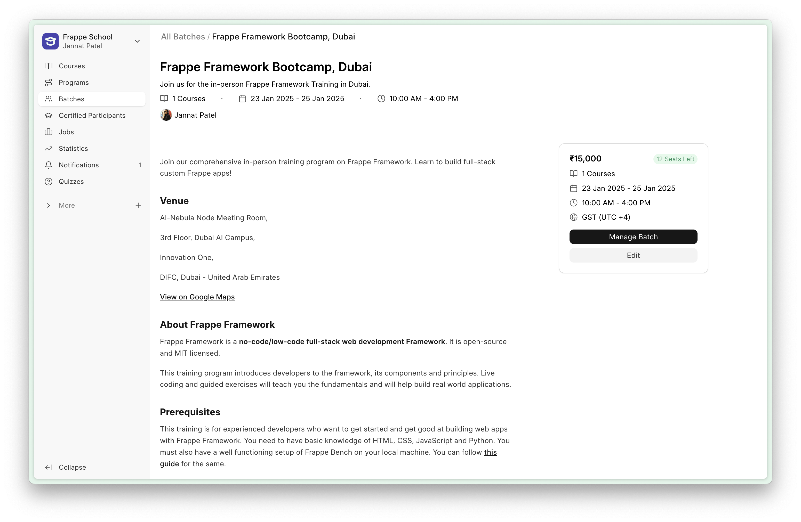
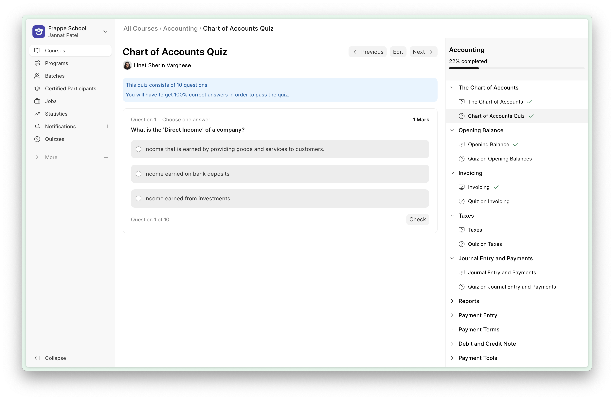
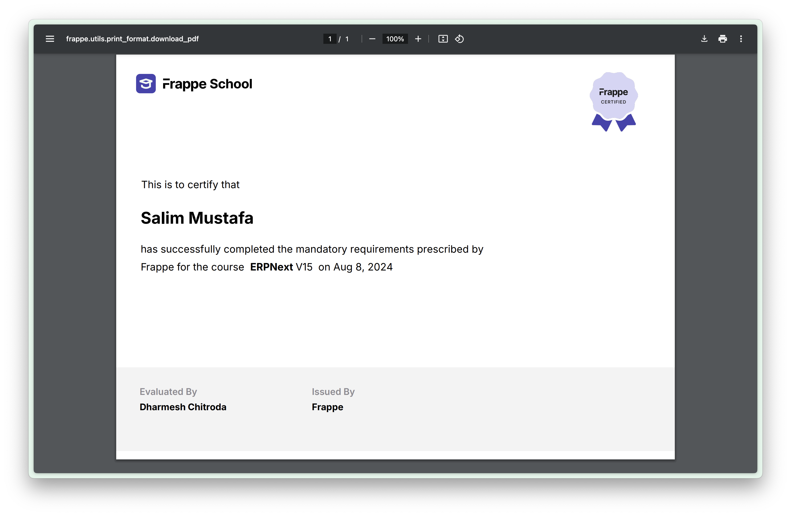

<h1>Frappe Learning</h1>

## Frappe Learning
Frappe Learning is an easy-to-use learning system that helps you bring structure to your content.

### Key Features

- **Structured Learning**: Design a course with a 3-level hierarchy, where your courses have chapters and you can group your lessons within these chapters. This ensures that the context of the lesson is set by the chapter.

- **Live Classes**: Group learners into batches based on courses and duration. You can then create Zoom live class for these batches right from the app. Learners get to see the list of live classes they have to take as a part of this batch.

- **Quizzes and Assignments**: Create quizzes where questions can have single-choice, multiple-choice options, or can be open ended. Instructors can also add assignments which learners can submit as PDF's or Documents.

- **Getting Certified**: Once a learner has completed the course or batch, you can grant them a certificate. The app provides an inbuilt certificate template. You can use this or else create a template of your own and use that instead.

View Screenshots

	
		Create batches to group your learners
	

 

	
		Evaluate their knowledge by quizzes
	

 

	
		Autenticate their work with certification
	

### Local

To setup the repository locally follow the steps mentioned below:

1. Install bench and setup a `frappe-bench` directory by following the [Installation Steps](https://frappeframework.com/docs/user/en/installation)
1. Start the server by running `bench start`
1. In a separate terminal window, create a new site by running `bench new-site learning.test`
1. Map your site to localhost with the command `bench --site learning.test add-to-hosts`
1. Get the Learning app. Run `bench get-app https://github.com/gihadalgahmi2026/lms.git`
1. Run `bench --site learning.test install-app lms`.
1. Now open the URL `http://learning.test:8000/lms` in your browser, you should see the app running
